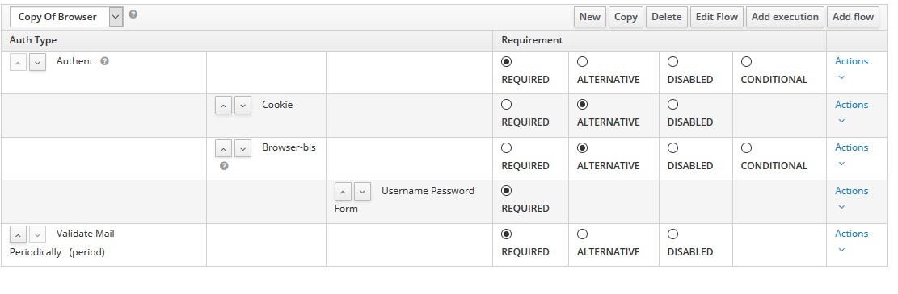

# Keycloak Mail validator

Simple keycloak authenticator to force user to verify email periodically.

## How to install

Build the jar :

```
mvn package
```

Copy it in `$keycloak/standalone/deployments`

## How to use 

Add the mail validation execution to authenticator flow (:warning: you need to set it as required, so you will need to wrap the old authenticator config in a generic flow to set it both as required ): 



Don't forget to set it to registration flow to verify user email at registration.

## How it works 

This authenticator adds an user attribute with the timestamp of the last email validation (last time the required action was put on the user).
When the user authenticates, we check if the period since last validation is greater than the period configured and add the required action if needed.